

  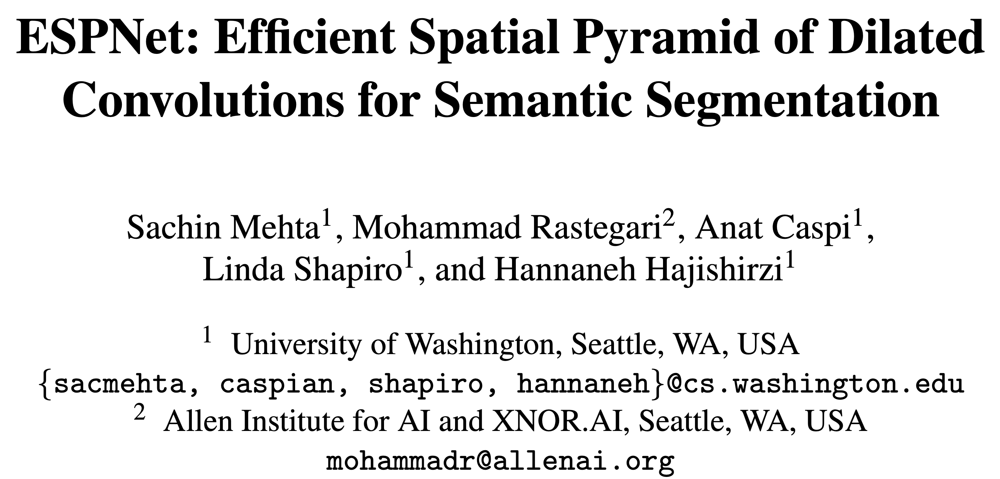

# Abstract

- A **<u>fast and efficient</u>** convolutional neural network **<u>ESPNet</u>**
  - **<u>ESPNet is based on a efficient spatial pyramid (ESP)</u>**, which is efficient in terms of computation, memory, and power.
  - ESPNet is 22 times faster (on a standard GPU) and 180 times smaller than PSPNet, while its category wise accuracy is only 8% less.
- We evaluated ESPNet on datasets including **<u>Cityscapes</u>**, **<u>PASCAL VOC</u>**, and a **<u>breast biopsy whole slide image</u>** dataset
  - Under the same constraints on memory and computation, **<u>ESPNet outperforms all the current efficient CNN networks</u>** such as MobileNet, ShuffleNet, and ENet on both standard metrics and efficiency on edge devices.

# ESPNet

## ESP Module

  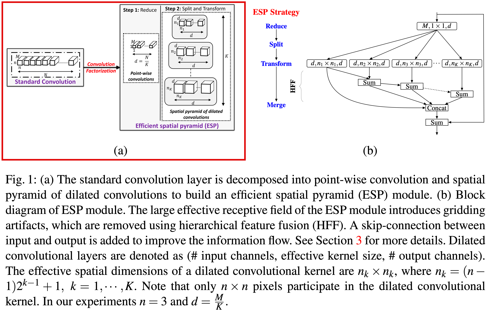

- ESPNet is based on **<u>efficient spatial pyramid (ESP) modules</u>**, which are a factorized form of convolutions that decompose standard convolution into a **<u>point-wise convolution</u>** and a **<u>spatial pyramid of dilated convolutions</u>**
  - $1 \times 1$ convolution to project high-dimensional feature maps onto a low-dimensional space.
  - re-samples these low-dimensional feature maps using $K, n \times n$ dilated convolutional kernels simultaneously
- This factorization drastically **<u>reduces the number of parameters and the memory, while preserving a large effective receptive field</u>**

### Width divider $K$

  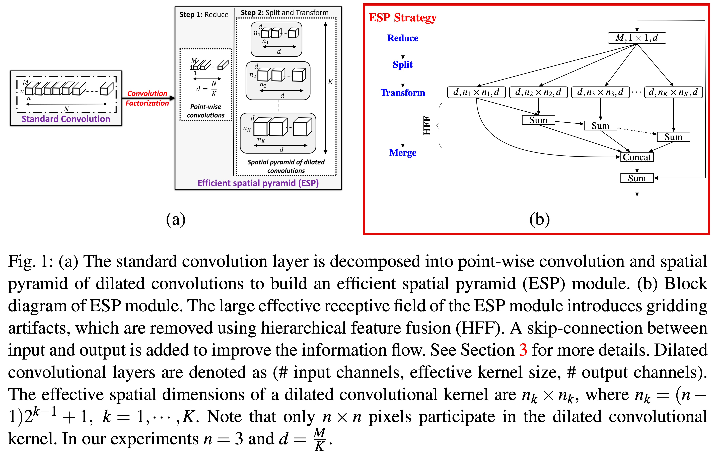

- The role of hyperparameter $K$ is **<u>to shrink the dimensionality</u>** of the feature maps uniformly across each ESP module
  1. Reduce
     - **<u>Reduces the feature maps</u>** from $M$-dimensional space to $\frac{N}{K}$-dimensional space **<u>using a point-wise convolution</u>**
  2. Split
     - **<u>Split</u>** across **<u>$K$ parallel branches</u>**
  3. Transform
     - Processes $K$​​ branches(feature maps) using **<u>$n \times n$​​ dilated convolutional kernels with different rates</u>** given by $2^{k-1}, k=\{1, \cdots, K-1\}$​​
  4. Merge
     - $K$ parallel **<u>outputs are concatenated</u>** to produce an $N$-dimensional output feature map.

### Hierarchical feature fusion (HFF) for de-gridding

	

- While concatenating the outputs of dilated convolutions, it introduces **<u>gridding artifacts</u>**.
  - To address the gridding artifact in ESP, the **<u>feature maps</u>** obtained using kernels of different dilation rates **<u>are hierarchically added before concatenating them (HFF, hierarchical feature fusion)</u>**.
  - This solution is **<u>simple</u>** and **<u>effective</u>** and **<u>does not increase complexity</u>**.
    - In contrast to **<u>existing methods</u>** that remove gridding artifact by learning more parameters **<u>using dilated convolutional kernels with small dilation rates</u>** (used in [Dilated ResNet](https://arxiv.org/abs/1705.09914), see 2 images below)

  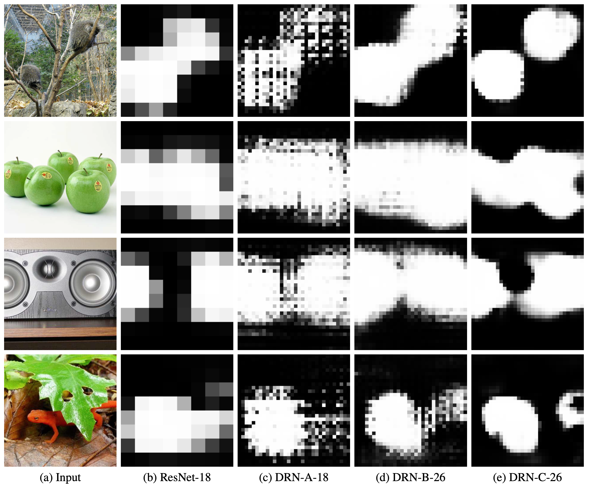
	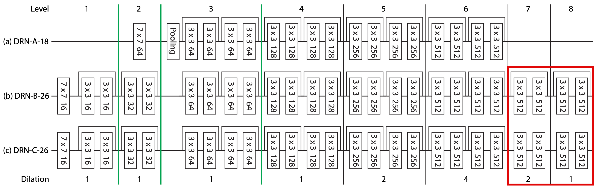
  <figcaption><i>Yu, F., Koltun, V., Funkhouser, T.: Dilated residual networks. CVPR (2017)</i></figcaption>

## Relationship with other CNN modules

  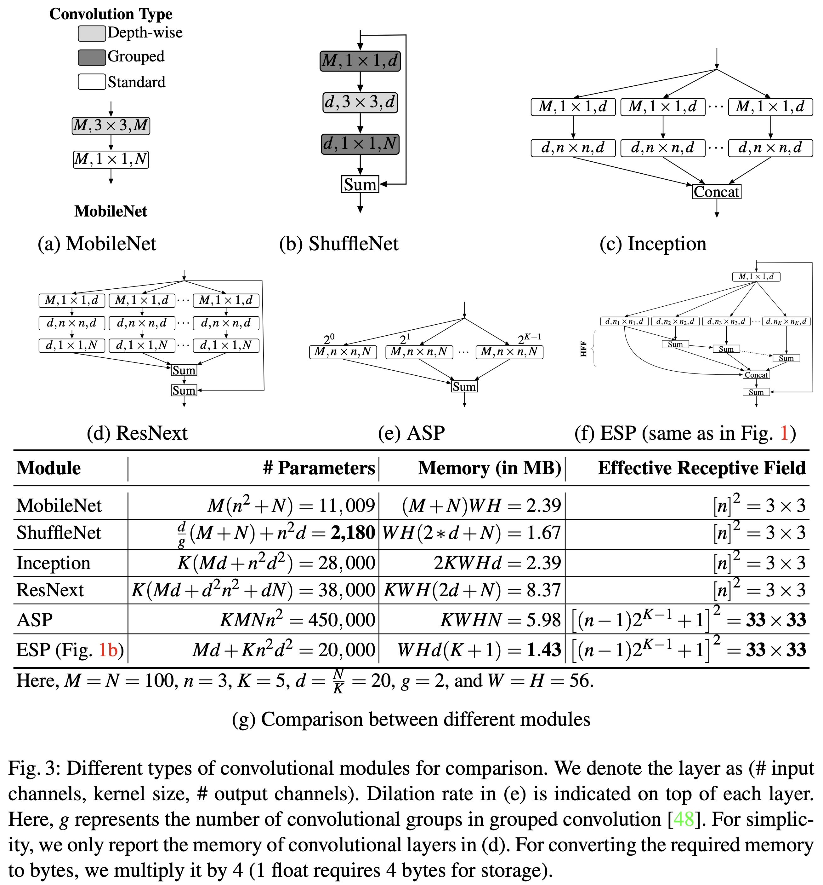

- MobileNet module (a)
  - depth-wise separable convolution (depth-wise conv + point-wise conv)
    - ESP module (with $K = N$) is almost identical to the MobileNet module, differing only in the order of convolutional operations
  - **<u>less parameters, high memory requirement, and smaller receptive field than ESP</u>**
- ShuffleNet module (b)
  - reduce - transform - expand
  - To reduce computation, makes use of grouped convolutions and depth-wise convolutions
  - **<u>many less parameters, higher memory requirements, and smaller receptive field than ESP</u>**

- Inception module (c - homogeneous version)
  - split - reduce - transform - merge
  - usually heterogeneous in number of channels and kernel size 
    - ESP modules are straightforward and simple to design
  - **<u>many parameters, higher memory requirements, and smaller receptive field than ESP</u>**
- ResNext module (d)
  - split - reduce - transform - expand - merge
  - **<u>many parameters, higher memory requirements, and smaller receptive field than ESP</u>**
- Atrous spatial pyramid (ASP) module (e)
  - split - transform - merge
  - perform well in segmentation tasks due to their high effective receptive fields.
  - **<u>many more parameters, higher memory requirements than ESP</u>**

# Experiments

## Experimental set-up

### Network structure

  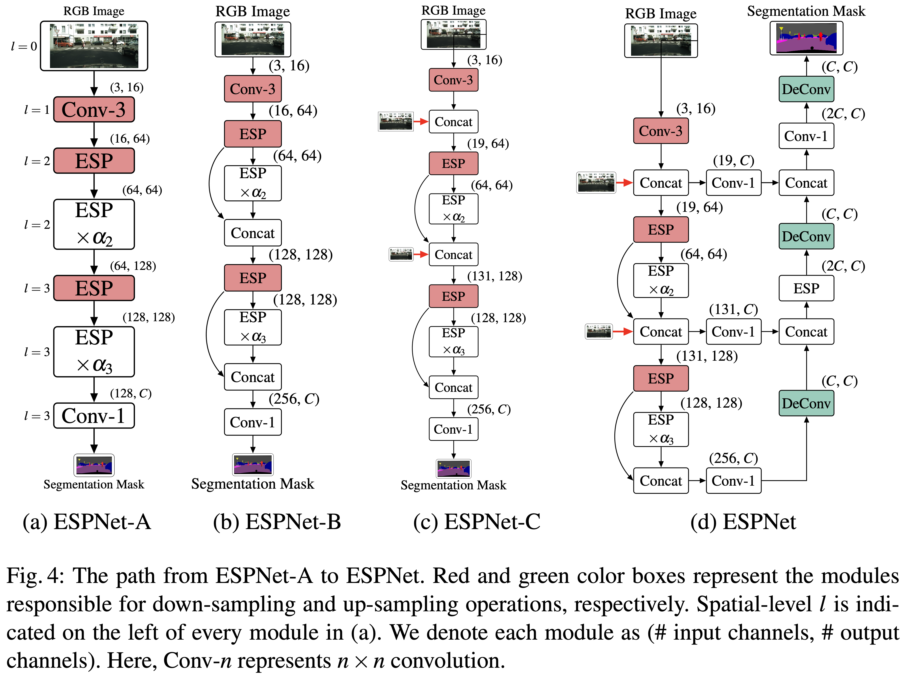

- ESPNet uses **<u>ESP modules</u>**
  - for **<u>learning</u>** convolutional kernels **<u>as well as down-sampling operations</u>**
- Different **<u>variants of ESPNet</u>**
  - ESPNet-A
    - standard network
  - ESPNet-B
    - **<u>improves the flow of information</u>** inside ESPNet-A by sharing the feature maps between the previous strided ESP module and the previous ESP module
  - ESPNet-C
    - **<u>reinforces the input image</u>** inside ESPNet-B to further improve the flow of information
  - ESPNet
    - **<u>adds a light weight decoder</u>** to ESPNet-C that outputs the segmentation mask of the same spatial resolution as the input.
- hyper-parameter $\alpha$
  - **<u>controls the depth of the network</u>** to build deeper computationally efficient networks for edge devices without change network topology
  - **<u>ESP module is repeated $\alpha_l$ times</u>** at spatial level $l$.
    - To be memory efficient, neither the ESP nor the convolutional modules are repeated at $l=0$ and $l=1$ because of the high spatial dimensions
  - In our experiments, we will refer to ESPNet with $\alpha_2=2$ and $\alpha_3 = 8$ as ESPNet until and otherwise stated explicitly.

## Results on the Cityscape dataset

### Comparison with state-of-the-art efficient convolutional modules

  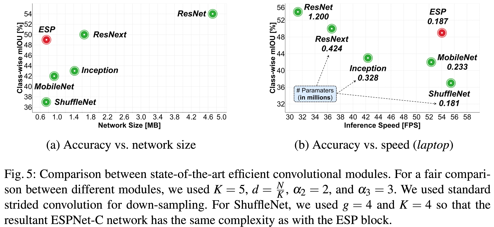

- We **<u>replaced</u>** the **<u>ESP modules</u>** in ESPNet-C with **<u>state-of-the-art efficient convolutional modules</u>** and evaluate their performance on the Cityscape validation dataset.
- ESP module **<u>outperformed MobileNet and ShuffleNet</u>** modules
  - while learning a similar number of parameters and having comparable network size and inference speed.
- ESP module delivered **<u>comparable accuracy to ResNext and Inception</u>** more efficiently.
- A basic ResNet module delivered the best performance, but had to learn $6.5 \times$more parameters.

### Comparison with state-of-the-art segmentation methods

  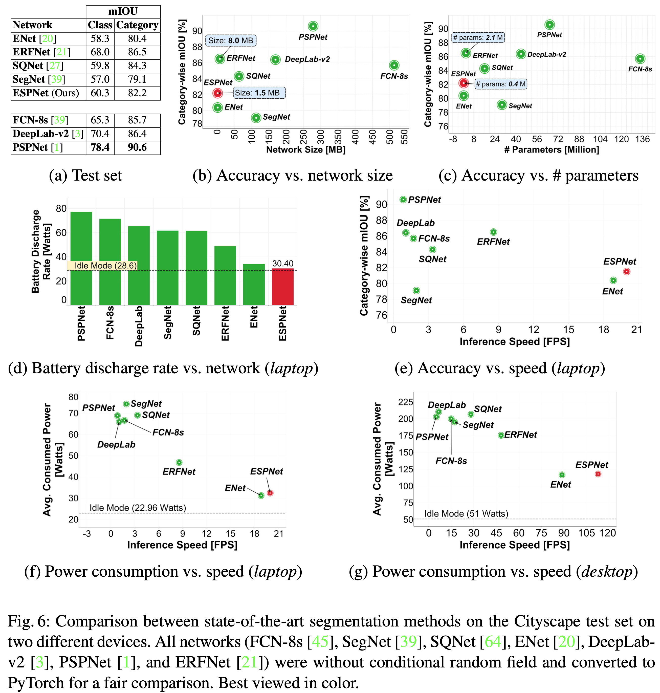

- **<u>ESPNet</u>** is 2% **<u>more accurate than ENet</u>**, while running $1.27\times$ and $1.16\times$ **<u>faster on a desktop and a laptop</u>**
- **<u>ESPNet</u>** has a **<u>lower classwise accuracy</u>** (makes some mistakes between classes that belong to the same category)
  - For example, a rider can be confused with a person.
- **<u>ESPNet</u>** delivers a **<u>good category-wise accuracy</u>**.
- **<u>ESPNet</u>** had 8% **<u>lower category-wise mIOU than PSPNet</u>**, while learning $180\times$ **<u>fewer parameters</u>**.
- **<u>ESPNet</u>** had **<u>lower power consumption</u>**, had **<u>lower battery discharge rate</u>**, and was significantly **<u>faster than state-of-the-art</u>** methods, while **<u>still achieving a competitive category-wise accuracy</u>**
- **<u>ERFNet</u>** delivered **<u>good segmentation accuracy</u>**, but has $5.5\times$**<u> more parameters</u>**, is $5.44\times$ larger, **<u>consumes more power</u>**, and has a **<u>higher battery discharge rate</u>** than ESPNet.

## Segmentation results on other datasets

  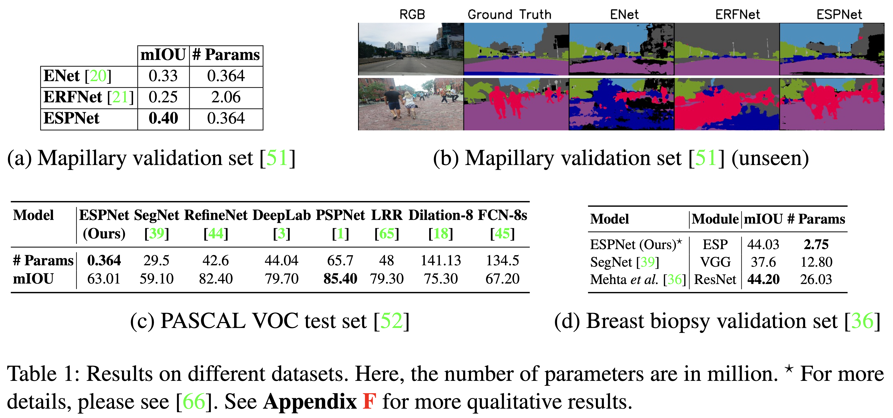

- On an unseen dataset (Mapillary dataset)
  - trained on the Cityscapes dataset
  - tested on the unseen(Mapillary) dataset
  - **<u>ESPNet learns good generalizable representations</u>** of objects and **<u>outperforms ENet and ERFNet</u>** both qualitatively and quantitatively on the unseen dataset.
- On the PASCAL dataset
  - **<u>ESPNet</u>** is **<u>4% more accurate than SegNet</u>** (one of the smallest network on the PASCAL VOC), while learning **<u>$81\times$ fewer parameters</u>**.
  - **<u>ESPNet</u>** is **<u>22% less accurate than PSPNet</u>** (one of the most accurate network on the PASCAL VOC) while learning **<u>$180 \times$ fewer parameters</u>**.
- On the breast biopsy dataset
  - **<u>ESPNet</u>** achieved the **<u>same accuracy as [36]</u>** while learning **<u>$9.5\times$ less parameters</u>**.

## Performance analysis on an edge device

  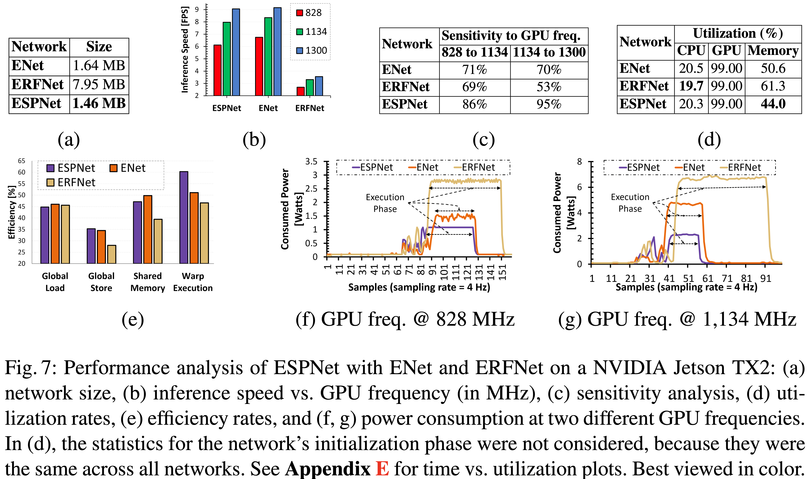

- We measure the **<u>performance on the NVIDIA Jetson TX2</u>**, a computing platform for edge devices
  - Network size - (a)
    - Compares the uncompressed 32-bit network size
    - **<u>ESPNet</u>** had a $1.12\times$ and $5.45\times$ **<u>smaller than ENet and ERFNet</u>**
  - Inference speed vs. GPU frequency [MHz], sensitivity to GPU frequency - (b, c)
    - **<u>ESPNet</u>** had **<u>almost the same frame rate as ENet</u>**, but it was **<u>more sensitive to GPU frequency</u>**
    - As a consequence, **<u>ESPNet</u>** achieved a **<u>higher frame rate than ENet on high-end graphic cards</u>**, such as the GTX- 960M and TitanX
  - Utilization rates - (d)
    - The **<u>memory</u>** footprint of **<u>ESPNet is lower than ENet and ERFNet</u>**, suggesting that **<u>ESPNet is suitable for memory-constrained devices</u>**.
  - Warp execution efficiency - (e)
    - **<u>ESPNet</u>** was about 9% **<u>higher than ENet</u>** and about 14% **<u>higher than ERFNet</u>**
      - This indicates that **<u>ESPNet</u>** has **<u>less warp divergence</u>** and **<u>promotes the efficient usage of limited GPU</u>** resources available on edge devices
  - Memory efficiency - (e)
    - **<u>All networks</u>** have **<u>similar global load</u>** efficiency
    - **<u>ERFNet</u>** has a **<u>poor store and shared</u>** memory efficiency
      - This is likely due to the fact that ERFNet spends 20% of the compute power performing memory alignment operations, while ESPNet and ENet spend 4.2% and 6.6% time for this operation.
  - Power consumption - (f, g)
    - The average power consumption (during network execution phase) of ESPNet, ENet, and ERFNet
      - 1W, 1.5W, and 2.9W at a GPU frequency of 824 MHz, respectively
      - 2.2 W, 4.6 W, and 6.7 W at a GPU frequency of 1,134 MHz, respectively
    - **<u>ESPNet is a power-efficient network</u>**.

## Ablation studies on the Cityscapes: The path from ESPNet-A to ESPNet

  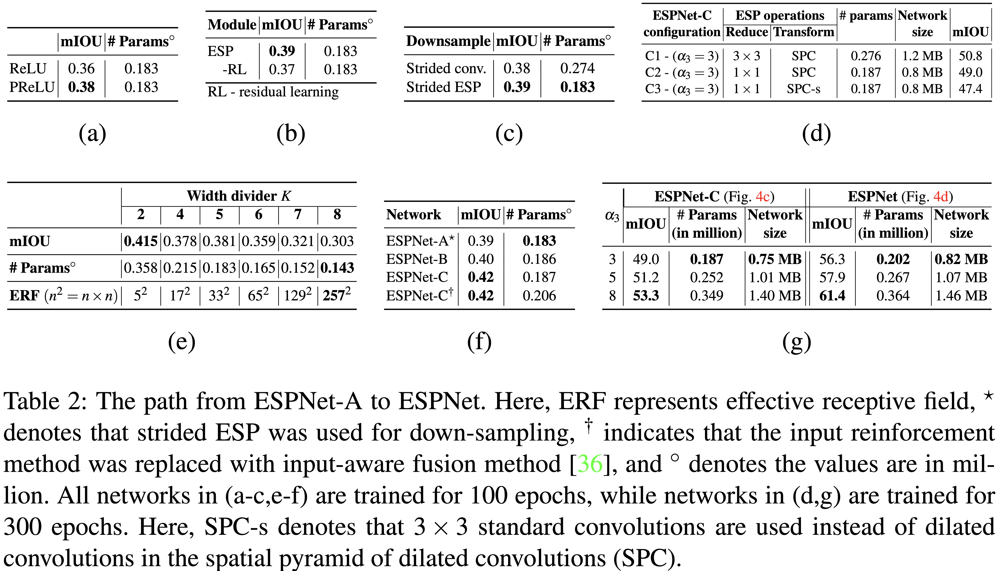

- ReLU vs PReLU - (a)
  - **<u>Replacing ReLU with PReLU</u>** in ESPNet-A **<u>improved the accuracy</u>** by 2%, while having a minimal impact on the network complexity.
- Residual learning in ESP - (b)
  - The **<u>accuracy of ESPNet-A dropped</u>** by about 2% when **<u>skip-connections</u>** in ESP modules were **<u>removed</u>**. (-RL)
- Down-sampling - (c)
  - **<u>Replacing</u>** the **<u>standard strided convolution</u>** with the **<u>strided ESP</u>** in ESPNet-A **<u>improved accuracy</u>** by 1% with 33% **<u>parameter reduction.</u>**
- Impact of different convolutions in the ESP block - (d)
  - Point-wise convolutions -  (C1, C2)
    - We **<u>replaced point-wise convolutions with $3 \times 3$ standard convolutions</u>** in the ESP block, and the resultant network demanded more resources (**<u>more parameters</u>**) while **<u>improving the mIOU</u>** by 1.8%.
  - Dilated convolutions vs. standard convolutions - (C2, C3)
    - We **<u>replaced</u>** $3 \times 3$ **<u>dilated convolutions</u>** with $3 \times 3$ **<u>standard convolutions</u>** in the ESP block. (SPC $\rightarrow$ SPC-s)
      - Though the resultant network is as efficient as with dilated convolutions, it is 1.6% **<u>less accurate</u>**
- Width divider $K$ - (e)
  - ESPNet-A’s **<u>accuracy decreased with increasing $K$</u>**
    - enlarges the effective receptive field
    - decreasing the number of network parameters
  - At $K = 5$, we found a **<u>good trade-off</u>** between number of parameters and accuracy, and therefore, we used $K = 5$ in our experiments
- ESPNet-A $\rightarrow$ ESPNet-C - (f)
  - ESPNet-A $\rightarrow$ ESPNet-B
    - **<u>Replacing</u>** the **<u>convolution-based network</u>** width expansion operation(ESPNet-A) **<u>with the concatenation operation</u>** (ESPNet-B)
    - **<u>improved the accuracy</u>** by about 1% and **<u>did not increase</u>** the number of network **<u>parameters noticeably</u>**.
  - ESPNet-B $\rightarrow$ ESPNet-C
    - With **<u>input reinforcement</u>** (ESPNet-C), the **<u>accuracy</u>** of ESPNet-B further **<u>improved</u>** by about 2%, while **<u>not increasing</u>** the network **<u>parameters drastically</u>**.
    - This is likely due to the fact that the **<u>input reinforcement</u>** method establishes a direct link between the input image and encoding stage, **<u>improving the flow of information</u>**.
- ESPNet-C vs ESPNet (g)
  - **<u>Adding a light-weight decoder</u>** to ESPNet-C **<u>improved the accuracy</u>** by about 6%, while **<u>increasing the number of parameters and network size by merely</u>** 20000 and 0.06 MB from ESPNet-C to ESPNet, respectively.

# Conclusion

- **<u>ESPNet, based on an efficient spatial pyramid module</u>**
- Our empirical analysis suggests that ESPNets are **<u>fast and efficient</u>**.
- ESPNet learns **<u>good generalizable</u>** representations of the objects and perform well in the wild.