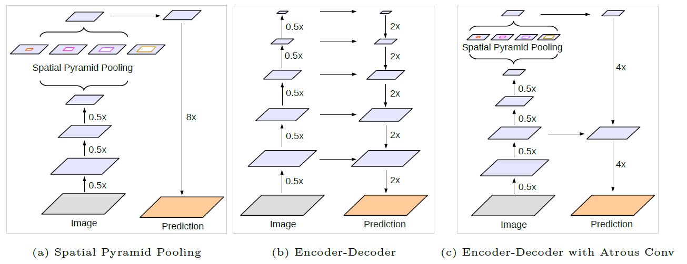

# DeeplabV3+

Encoder-Decoder with Atrous Separable Convolution for Semantic Image Segmentation

# Introduction

## Motivation

### Two Approaches

1. spatial pyramid pooling module → captures rich contextual information at different resolution
2. encoder-decoder structure → obtain sharp object boundaries.

1. spatial pyramid pooling module
- Deeplab applies Atrous Spatial Pyramid Pooling (Dilated Conv with different rates)
- PSPNet performs pooling operations at different grid scales

But, detailed information related to object boundaries is missing!!

How to solve? → **applying the "atrous convolution" to extract denser feature maps**

But, computationally expensive! (Why?: 

2. encoder-decoder models are faster and gradually recover sharp object boundaries

Thus, combine 1. and 2.

## Contributions (Deeplab V3+)

- Combine encoder-decoder structure and ASPP (Deeplab)
- Arbitrarily control the resolution of extracted encoder features by atrous convolution
- Introduced Xception model and depthwise separable convolution to both ASPP module and decoder module (faster and stronger!)

[https://github.com/tensorflow/models/tree/master/research/deeplab](https://github.com/tensorflow/models/tree/master/research/deeplab)

## Methods

### Atrous Conv

- Control the resolution of features

(Q. Isn't precisely that Atrous Conv, Dilated Conv without Pooling keeps high resolution features?)

(Q. Isn't that just conv without pooling many times will have same effect?)

- Increase filter's FoV

### Depthwise separable convolution

depthwise convolution followed by a pointwise convolution (i.e., 1×1 convolution)

- Reduces computation complexity
- Here applies atrous separable convolution

### DeepLabv3 as encoder

Term "output stride": as the ratio of input image spatial resolution to the final output resolution

Typically OS = 32 for image classification

- OS = 8 or 16 (and apply atrous convolution)

(e.g., rate = 2 and rate = 4 to the last two blocks respectively for output stride = 8).

- Atrous Spatial Pyramid Pooling module
- encoder output = last feature map before logits as in the original DeepLabv3

### Proposed decoder

DeeplabV3 → bilinearly upsampled by a factor of 16

DeeplabV3+ → bilinearly upsampled by a factor of 4 + concat w/ low-level features

(1) bilinearly upsampled by a factor of 4

(2) concatenated with the corresponding low-level features

(3) apply another 1 × 1 convolution on the low-level features to reduce the number of channels

(4) apply a few 3 × 3 convolutions to refine the features

(5) another simple bilinear upsampling by a factor of 4

e.g., Conv2 before striding in ResNet-101

### Modifed Xception

(1) more layers

(2) all the max pooling operations are replaced by depthwise separable convolutions with striding

(3) extra batch normalization and ReLU are added after each 3 × 3 depthwise convolution, similar to MobileNet

## Experimental Evaluation

- ImageNet-1k pretrained ResNet-101 or modified aligned Xception
- PASCAL VOC 2012 (21 classes mIOU)
- crop size 513 × 513 (OS=16)

### Decoder Design Choices

When employing output stride = 16, naive decoder is 1.2% better than not using this naive decoder during training (i.e., downsampling groundtruth during training)

In the decoder module,

(1) the 1×1 convolution used to reduce the channels of the low-level feature map from the encoder module

- Choose [1 × 1, 48] for channel reduction.

(2) the 3 × 3 convolution used to obtain sharper segmentation results

- Do after concatenating the Conv2 feature map (before striding) with DeepLabv3 feature map
- more effective to employ two 3×3 convolution with 256 filters than using simply one or three convolutions.
- Changing the number of filters from 256 to 128 or the kernel size from 3 × 3 to 1×1 degrades performance
- Using  both Conv2 and Conv3 feature maps didn't help

Note: Proposed DeepLabv3+ model has output stride = 4. Not pursue further denser output feature map (i.e., output stride < 4) given the limited GPU resources!?

(3) Further enconding

### ResNet-101 as Network Backbone

- Atrous Conv → able to obtain features at different resolutions during training and evaluation
- extracting denser feature maps during evaluation (i.e., eval output stride = 8) and adopting multi-scale inputs increases performance

### Improvement along Object Boundaries

### Experimental Results on Cityscapes

