# Introduction

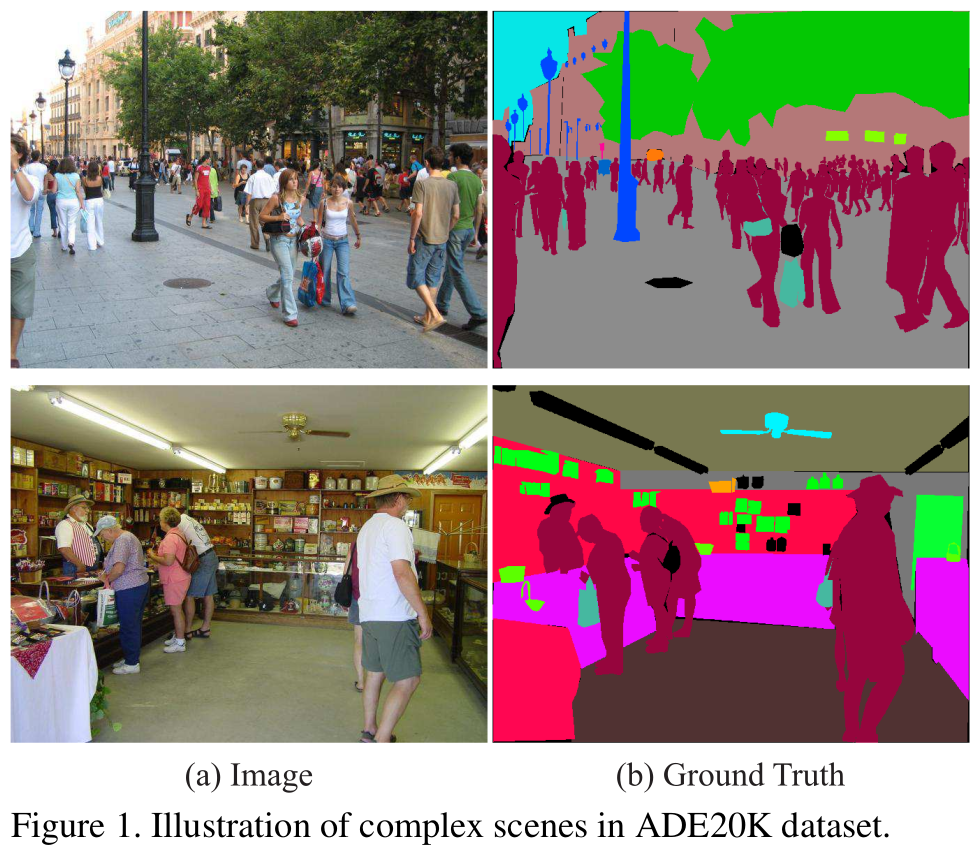

- **FCN(Fully Convolutional Network) 기반 모델은** global scene category clue를 활용하지 못하기 때문에 다음과 같은 특징을 지닌 ADE20K와 같은 **complex scene parsing에서 잘 동작하지 않는다.** (*Figure 1*)
  - Unrestricted open vocabulary
  - Diverse scenes
- **PSPNet은** global feature를 활용하는 구조를 통해 **이러한 문제를 해결하였다.**
  - Global pyramid pooling module을 통해 **local 및 global clue를 모두 활용**해서 reliable prediction을 수행한다.
  - **다양한 dataset에서 SOTA**의 성능을 기록하였다.
    - ImageNet scene parsing challenge 2016
    - PASCAL VOC 2012 semantic segmentation benchmark
    - Cityscapes benchmark
- 본 논문의 **main contribution**은 다음과 같다.
  - 다양한 scenery context feature를 포함하는 **PSPNet(pyramid scene parsing network)를 제안**
  - ResNet을 학습하기 위한 **deeply supervised loss based optimization** 방법 제안
  - **Scene parsing** 및 **semantic segmentation** 모두에서 **SOTA**를 기록

# Pyramid Scene Parsing Network

## Important Observations

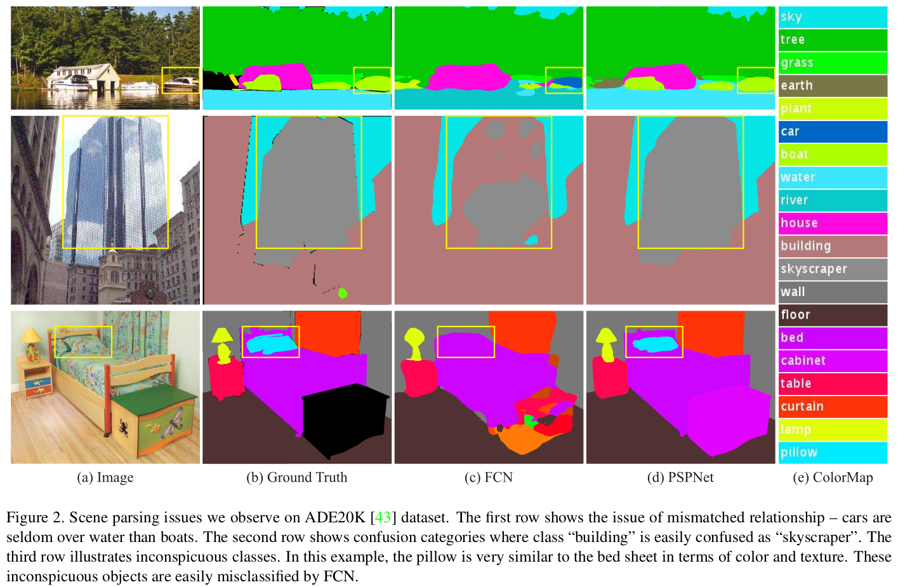

- **FCN이 ADE20K dataset(complex-scene parsing)에서 잘 동작하지 못하는 이유**는 다음과 같다.
  - **Mismatched Relationship**
    - *Figure 2*의 첫번째 행에서, FCN은 river위의 boat를 car로 예측
      - Appearance 정보만을 고려한 결과
      - Car는 river위에 등장하기 어렵다는 context relationship을 고려하지 못하였음
    - **Contextual information을 활용하지 못함**
  - **Confusion Categories**
    - ADE20K에는 similar appearance를 가지는 class label pair가 많이 존재
      - Ex) field, earth / mountain, hill / wall, house, building, skyscraper
    - *Figure 2*의 두번째 행에서, FCN은 building, skyscraper가 섞인 형태로 예측
    - **Category간의 relationship을 활용하지 못함**
  - **Inconspicuous Classes**
    - Scene은 arbitrary size의 object/stuff들을 포함
      - Small object : hard to find
      - Big object : discontinuous prediction
    - *Figure 2*의 세번째 행에서, FCN은 pillow를 curtain으로 예측
      - Global scene category만을 고려하면 bed와 같은 무늬를 가지는 pillow를 찾기 어려움
    - Inconspicuous category를 포함하는 **다양한 sub-region들을 모두 고려하지 못함**
- 위의 결과들을 통해, 본 논문에서는 **global-scene-level prior**를 갖춘 네트워크가 scene parsing에서 성능을 높일 수 있다고 주장한다.

## Pyramid Pooling Module

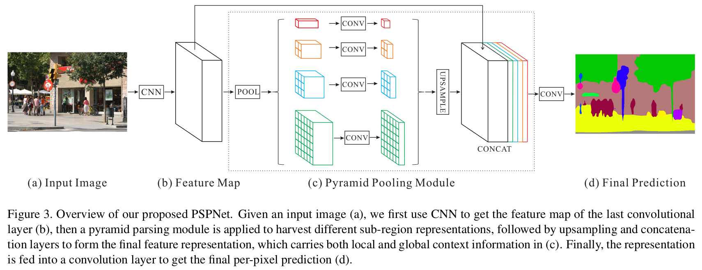

- **CNN**은 **receptive field의 크기가 고정**되어 네트워크가 global scenery prior를 통합하지 못하게 한다는 한계가 있다.
- 또한, **Global average pooling**은 global contextual prior로 사용할 수 있지만, ADE20K와 같은 **complex scene에서는** 중요한 정보들을 모두 고려하기에 **부족**하다.
  - Scene image는 많은 object들과 연관되어 있는데, 이들을 바로 single vector로 만들어 버리면 **spatial relation을 잃을 수 있다.**
- 따라서, **PSPNet**에서는 다음과 같이 동작하는 **pyramid pooling module**을 global scene prior로 사용해 **다양한 scale 및 sub-region에 따른 정보들을 포함**하는 방법을 사용한다. (*Figure 3 - (c)*)
  1. 4가지의 각기 다른 pyramid scale에서 각각 1$\times$1, 2$\times$2, 3$\times$3, 6$\times$6 크기의 pooling을 생성
     - Pyramid에서 feature map을 가장 coarse하게 분리하는 최상단의 빨간색으로 표시된 부분은 global pooling을 생성
     - Pyramid의 나머지 부분은 feature map을 각기 다른 sub-region에 분리하여 해당하는 location에 대한 pooling을 생성
  2. 1$\times$1 convolution을 사용해 $1/N$으로 dimension을 축소
     - $N$은 pyramid의 level size (여기서는 4개)
  3. Bilinear interpolation을 통해 원본 feature map의 크기로 upsampling
  4. 원본 feature map에 concatenate

## Network Architecture

- **PSPNet의 전체적인 구조**는 다음과 같다. (*Figure 3*)
  - **Pre-trained ResNet** (*Figure 3*에서 (a)와 (b)의 사이에 있는 CNN)
    - Dilated convolution을 사용
    - Input image를 받아서 feature map(*Figure 3 - (b)*)을 생성하고 pyramid pooling module로 전달
      - Feature map의 output size는 input image의 1/8이 됨
  - **Pyramid pooling module** (*Figure 3 - (c)*)
    - Global scene prior로서 여러 level에서의 context 정보를 추출
  - **Final convolution layer** (*Figure 3*에서 (c)와 (d) 사이에 있는 conv)
    - Pyramid pooling module의 결과를 받아서 최종 prediction map 생성

## Deep Supervision for ResNet-Based FCN

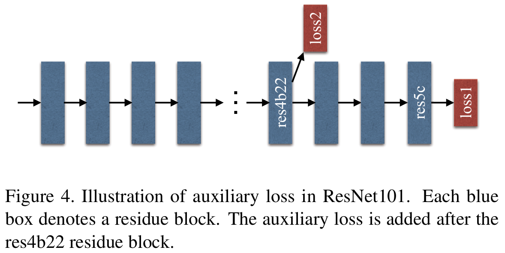

- PSPNet의 **ResNet은 2가지의 loss를 통해 optimization**을 수행하였다. (*Figure 4*)
  - **Master branch loss** (*Figure 4*의 loss 1)
    - Softmax Loss
    - 더 많은 responsibility (weight 0.6)
  - **Auxiliary loss** (*Figure 4*의 loss 2)
    - Softmax Loss
    - 더 적은 responsibility (weight 0.4)
    - 학습 과정에서 optimize를 돕는 역할로만 사용되며 test시에는 사용되지 않음
  - 위의 2가지 loss는 모든 previous layer에 전파되도록 함
    - <a href="https://arxiv.org/abs/1512.05830" target="_blank" rel="noopener noreferrer">Relay backpropagation</a>을 사용하지 않음

# Experiments

- PSPNet은 다음의 3가지 dataset에서 평가하였다.
  - **ImageNet** scene parsing challenge 2016
  - **PASCAL VOC** 2012 semantic segmentation
  - **Cityscapes** urban scene understanding dataset

## Implementation Details

- Poly learning rate
  - $lr_{current} = lr_{base} \left( 1 - \frac{iter}{max_{iter}} \right)^{power}$
    - $lr_{base} = 0.01$
    - $power = 0.9$
- Iteration
  - ImageNet : 150K
  - PASCAL VOC : 30K
  - Cityscape : 90K
- Batch size
  - 16
- Optimizer
  - Stochastic Gradient Descent(SGD)
  - Momentum : 0.9
  - Weight decay : 0.0001
- Data augmentation
  - Random resize : 0.5 ~ 2
  - Random rotation : -10$^\circ$ ~ 10$^\circ$
  - Random gaussian blur
- Loss weight
  - Master branch loss : 0.6
  - Auxiliary loss : 0.4

## ImageNet Scene Parsing Challenge 2016

### Ablation Study for PSPNet

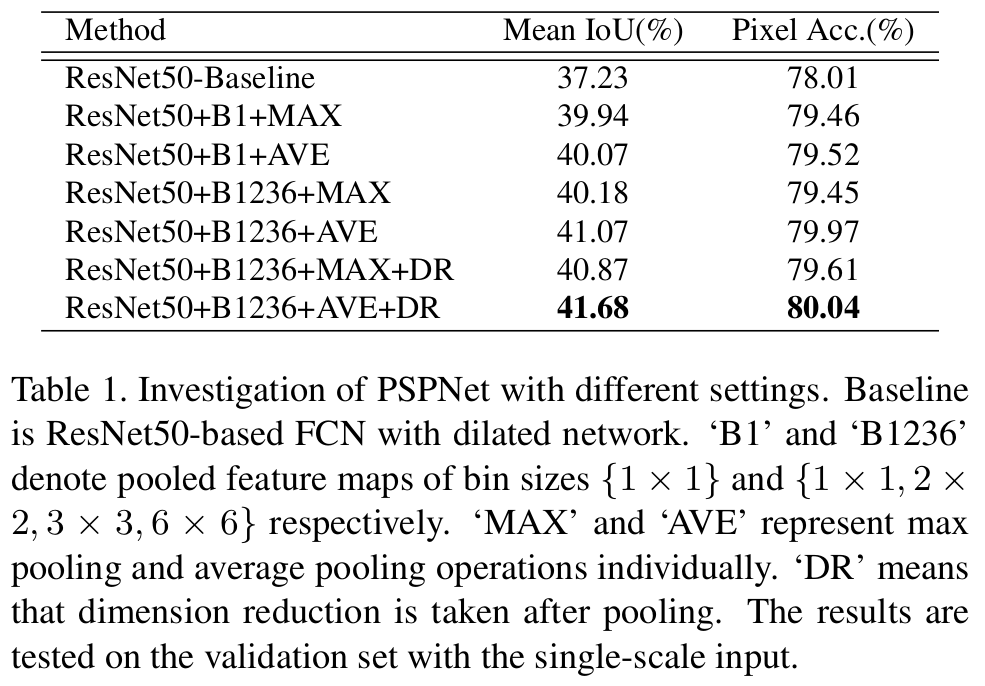

- 여러가지 설정에 따른 성능 비교 결과는 *Table 1*과 같다.
  - ResNet50-based FCN with dilated network를 baseline으로 validation set에서 평가
  - **Average pooling(AVE)** > Max pooling(MAX)
  - **Pyramid parsing(B1236)** > Global pooling(B1)
  - **Dimension reduction(DR)**이 성능을 향상시킴

### Ablation Study for Auxiliary Loss

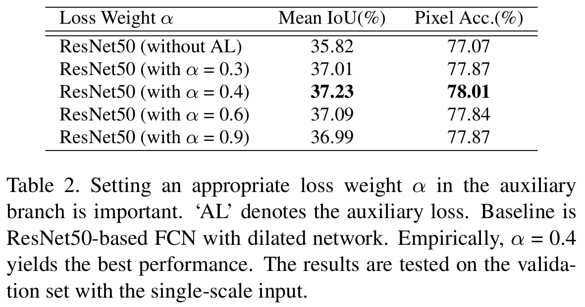

- **Auxiliary loss**에 따른 성능 비교 결과는 *Table 2*와 같다.
  - ResNet50-based FCN with dilated network를 baseline으로 validation set에서 평가
  - Auxiliary loss를 사용한 모델이 더 좋은 성능을 보임
  - **Weight  $\alpha = 0.4$**에서 가장 좋은 성능을 보임

### Ablation Study for Pre-trained Model

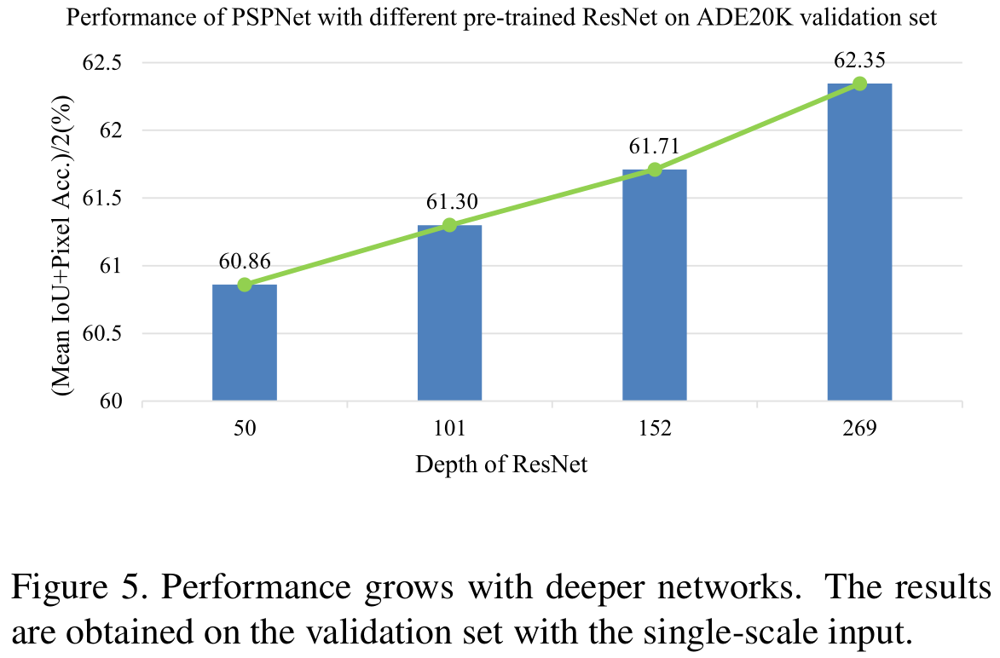

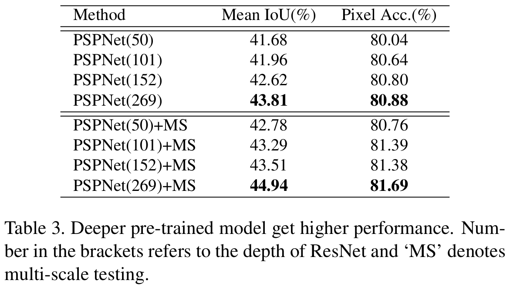

- **Pre-trained model의 깊이**에 따른 성능 비교 결과는 *Figure 5*, *Table 3*와 같다.
  - PSPNet에서 ResNet의 깊이를 {50, 101, 152, 269}로 증가시키며 validation set에서 평가
  - Depth는 **깊어질수록 좋은 성능**을 보임

### More Detailed Performance Analysis

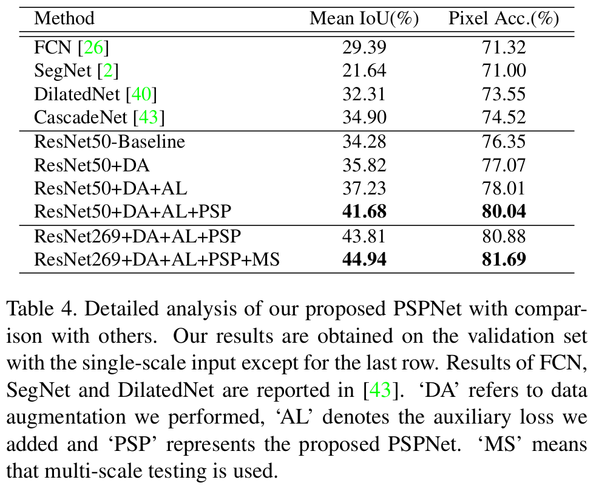

- *Table 4*는 **validation set**에서 PSPNet을 다른 모델들과 비교한 결과이다.
  - **PSPNet이 가장 좋은 성능**을 보임

### Results in Challenge

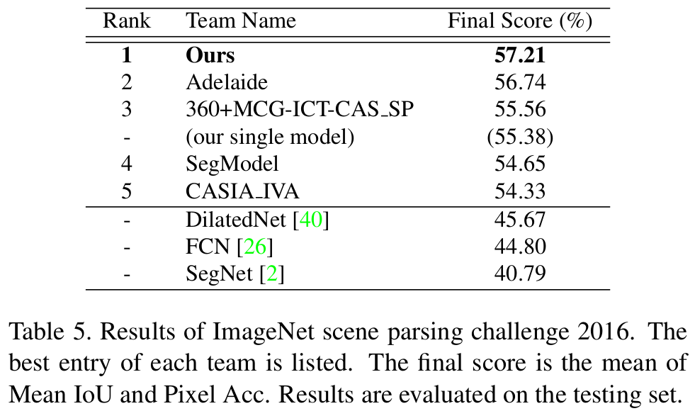

- *Table 5는* test set에서의 ImageNet scene parsing challenge 2016 순위이다.
  - **PSPNet이 가장 높은 점수**로 1위를 차지하였음

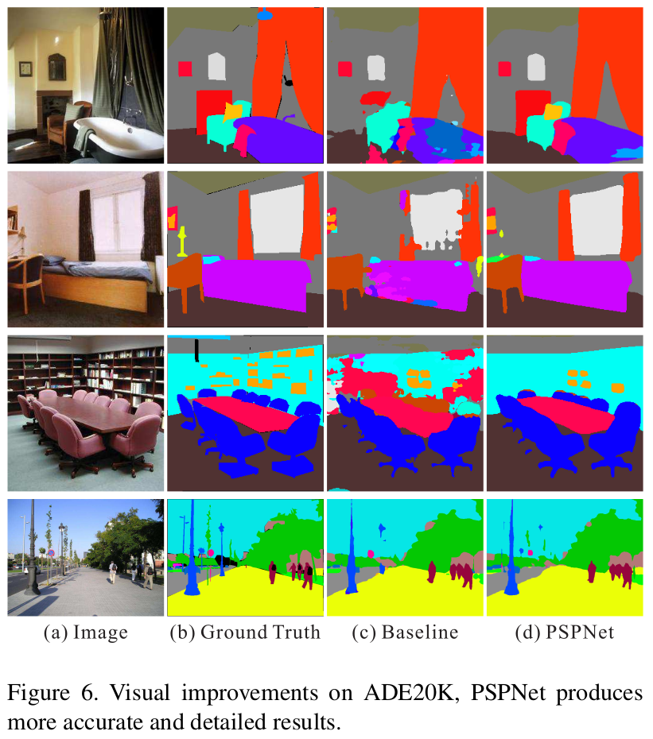

- *Figure 6*는 PSPNet이 Baseline보다 더 정확하고 세밀하게 segmenatation을 수행한다는 것을 보여준다.
  - **FCN의 한계점들을 PSPNet에서 해결**하였음을 보여줌

## PASCAL VOC 2012

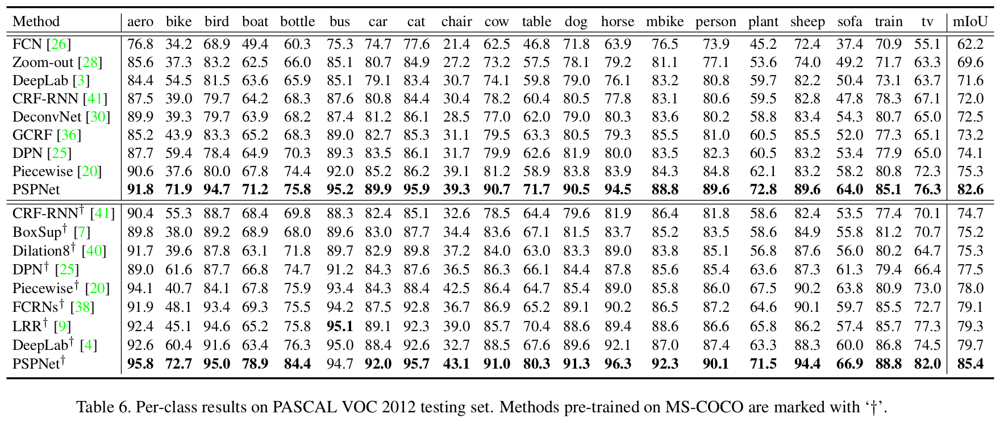

- *Table 6*는 **test set**에서 PSPNet을 다른 모델들과 비교한 결과이다.
  - DeepLab을 비롯한 몇가지 모델들과의 공정한 비교를 위해 ResNet101 기반의 PSPNet으로 비교
  - $\dagger$가 붙은 모델은 MS-COCO dataset에서 pre-training을 수행한 모델을 의미
  - **PSPNet이 가장 좋은 성능**을 보임
    - 심지어 MS-COCO에서 pretraining을 수행한 다른 모델들보다 좋은 성능을 보였음
  - ResNet이 나온지 얼마 되지 않은 시점이어서 ResNet을 적용했기 때문에 좋은 성능이 나온것이라는 반박이 있을 것으로 예상하여 최신 모델들과의 성능도 비교
    - FCRNs, LRR, DeepLab 등의 SOTA 모델들보다도 좋은 성능을 보임

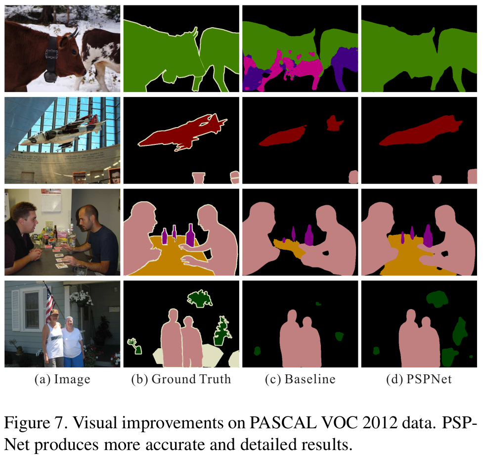

- *Figure 7*은 PASCAL VOC에서 **Baseline보다 PSPNet이 더 정확하고 세밀하게 segmentation을 수행**한다는 것을 보여준다.
  - 첫번째 행에서 cows를 horse와 dog로 잘못 인식한 문제를 해결
  - 두번째 행, 세번째 행에서 각각 aeroplane, table의 missing part를 찾음
  - 세번째, 네번째 행에서 person. bottle, plant를 잘 찾으므로 작은 object에 대해서도 잘 동작한다는 것을 알 수 있음

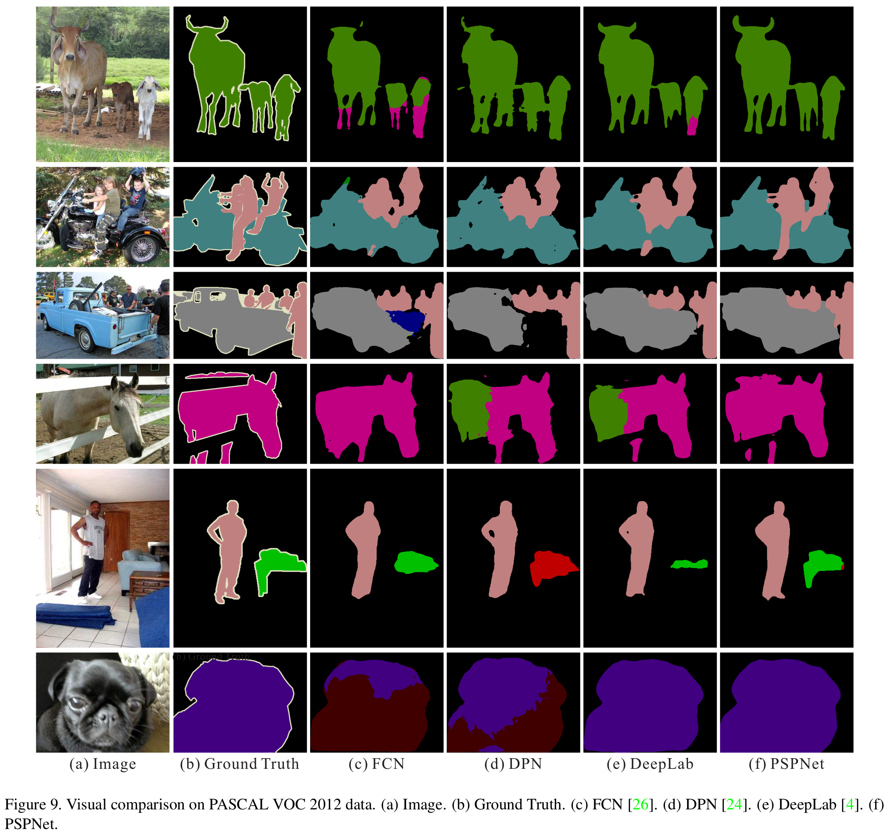

- *Figure 9*은 PASCAL VOC에서의 PSPNet을 포함한 여러 모델들의 segmentation 결과이다.

## Cityscapes

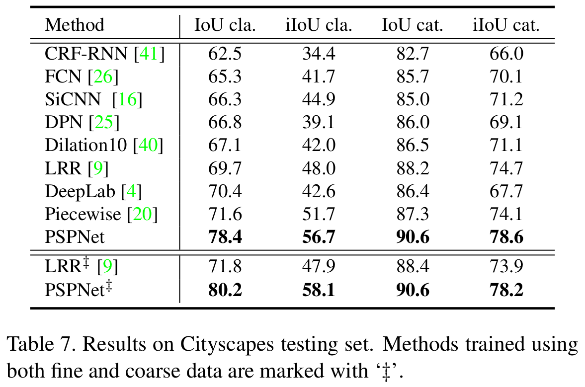

- *Table 7*은 Test set에서 PSPNet을 다른 모델들과 비교한 결과이다.
  - 학습에는 fine annotation data만을 사용하였고, coarse annotation data까지 함께 학습시킨 모델은 $\ddagger$로 표시
    - <a href="https://www.cityscapes-dataset.com/examples/" target="_blank" rel="noopener noreferrer">Cityscapes dataset의 fine-annotation과 coarse annotation 비교</a>
  - DeepLab과의 공정한 비교를 위해 ResNet101 기반의 PSPNet으로 비교
  - PSPNet이 가장 좋은 성능을 보임

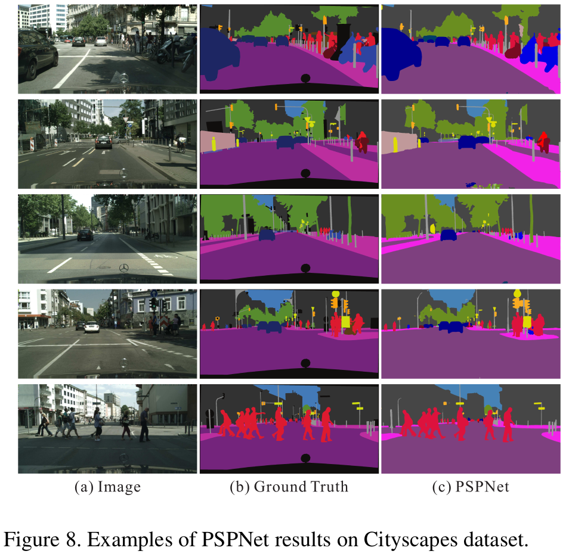

- *Figure 8*은 Cityscapes datset에서의 PSPNet의 segmentation 결과를 나타낸 것이다.

# Concluding Remarks

- **PSPNet(Pyramid Scene Parsing Network)은 complex scene understanding에서 좋은 성능**을 보인다.
  - **Global pyramid pooling feature**를 통해 추가적인 contextual 정보를 제공
  - **Deeply supervised optimization** 방법을 통해 ResNet 기반의 FCN 네트워크를 학습