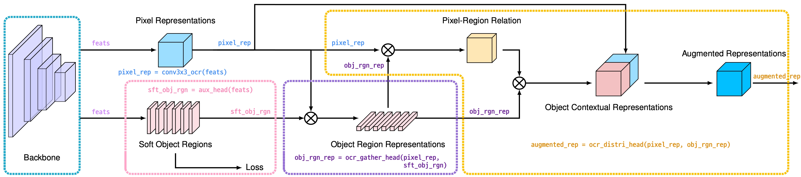
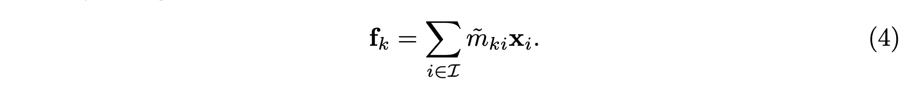
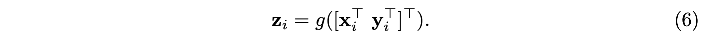
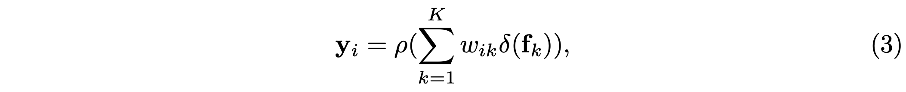
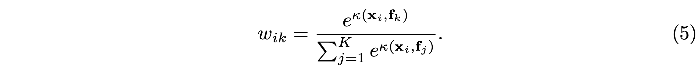

# Segmentation Transformer: Object-Contextual Representations for Semantic Segmentation

📝 **논문 저자 깃허브**

[HRNet-Semantic-Segmentation/seg_hrnet_ocr.py at HRNet-OCR · HRNet/HRNet-Semantic-Segmentation](https://github.com/HRNet/HRNet-Semantic-Segmentation/blob/HRNet-OCR/lib/models/seg_hrnet_ocr.py)

**🔗 논문 링크**

[](https://arxiv.org/pdf/1909.11065.pdf)

**목차**

## Segmentation Transformer - Code Implementation



```python
def forward(self, x): 
		# Input : torch.Size([1, 3, 1024, 2048])
		
		...
		# (HRNet 코드)
		...

		# Backbone output : torch.Size([1, 720, 256, 512])
		feats = torch.cat([x[0], x1, x2, x3], 1)

    # 1. Pixel Representations x_i : torch.Size([1, 512, 128, 256])
    pixel_rep = self.conv3x3_ocr(feats)

    # 2. Soft Object Regions(coarse seg map) M_K : torch.Size([1, 19, 128, 256])
    sft_obj_rgn = self.aux_head(feats)

    # 3. Object Region Representations f_k : torch.Size([1, 512, 19, 1])
    obj_rgn_rep = self.ocr_gather_head(feats=pixel_rep,
                                       probs=sft_obj_rgn)

    # 4. Augmented Representations z_i : torch.Size([1, 512, 256, 512])
    augmented_rep = self.ocr_distri_head(pixel_rep, obj_rgn_rep)
    
    # 5. Final Segmentation Output : torch.Size([1, 19, 256, 512])
    out = self.cls_head(augmented_rep)

		# Backprop을 위한 output 2개
    out_aux_seg = [] 
    out_aux_seg.append(sft_obj_rgn) # Soft Object Regions(coarse seg map)
    out_aux_seg.append(out)         # Final Segmentation Output

    return out_aux_seg
```

### 1. Pixel Representations $\mathbf{x}_i$

**[Code]**

- `pixel_rep`

    ```python
    # 1. Pixel Representations x_i : torch.Size([1, 512, 128, 256])
    pixel_rep = self.conv3x3_ocr(feats)
    ```

- `self.conv3x3_ocr`

    ```python
    self.conv3x3_ocr = nn.Sequential(
                nn.Conv2d(last_inp_channels, ocr_mid_channels,
                          kernel_size=3, stride=1, padding=1),
                BatchNorm2d(ocr_mid_channels),
                nn.ReLU(inplace=relu_inplace),
            )
    ```

**[Concept]**

- $\mathbf{x}_i$ is the representation of pixel $p_i$ of an image $I$

### 2. Soft Object Regions $M_K$

**[Code]**

- `sft_obj_rgn`

    ```python
    # 2. Soft Object Regions(coarse seg map) M_K : torch.Size([1, 19, 128, 256])
    sft_obj_rgn = self.aux_head(feats)
    ```

- `self.aux_head`

    ```python
    self.aux_head = nn.Sequential(
                nn.Conv2d(last_inp_channels, last_inp_channels,
                          kernel_size=1, stride=1, padding=0),
                BatchNorm2d(last_inp_channels),
                nn.ReLU(inplace=relu_inplace),
                nn.Conv2d(last_inp_channels, config.DATASET.NUM_CLASSES,
                          kernel_size=1, stride=1, padding=0, bias=True)
            )
    ```

**[Concept]**

- We partition the image $I$ into $K$ soft object regions $\{M_1, M_2, \cdots, M_K \}$.
- Each object region $M_K$ corresponds to the class $k$, and is represented by a 2D map (or coarse segmentation map), where each entry indicates the degree that the corresponding pixel belongs to the class $k$.

### 3. Object Region Representations $\mathbf{f}_k$

**[Code]**

- `obj_rgn_rep`

    ```python
    # 3. Object Region Representations f_k : torch.Size([1, 512, 19, 1])
    obj_rgn_rep = self.ocr_gather_head(feats=pixel_rep,
                                       probs=sft_obj_rgn)
    ```

- `self.ocr_gather_head`

    ```python
    self.ocr_gather_head = SpatialGather_Module(config.DATASET.NUM_CLASSES)
    ```

- `SpatialGather_Module`

    ```python
    class SpatialGather_Module(nn.Module):
        """
            Aggregate the context features according to the initial 
            predicted probability distribution.
            Employ the soft-weighted method to aggregate the context.
        """
        def __init__(self, cls_num=0, scale=1):
            super(SpatialGather_Module, self).__init__()
            self.cls_num = cls_num
            self.scale = scale

        def forward(self, pixel_rep, sft_obj_rgn):
            # sft_obj_rgn : torch.Size([1, 19, 128, 256])
            # pixel_rep   : torch.Size([1, 512, 128, 256])
            
            batch_size, c, h, w = sft_obj_rgn.size(0), sft_obj_rgn.size(1), sft_obj_rgn.size(2), sft_obj_rgn.size(3)
            sft_obj_rgn = sft_obj_rgn.view(batch_size, c, -1)
            pixel_rep = pixel_rep.view(batch_size, pixel_rep.size(1), -1)
            pixel_rep = pixel_rep.permute(0, 2, 1) # batch x hw x c 

            sft_obj_rgn = F.softmax(self.scale * sft_obj_rgn, dim=2)# batch x k x hw

            # sft_obj_rgn: m_ki,  pixel_rep: x_i
            ocr_context = torch.matmul(sft_obj_rgn, pixel_rep).permute(0, 2, 1).unsqueeze(3) # batch x k x c
            return ocr_context
    ```

**[Concept]**

- We aggregate the representations of all the pixels weighted by their degrees belonging to the $k$th object region, forming the $k$th object region representation:



- $\mathbf{x}_i$ is the representation of pixel $p_i$.
- $\tilde{m}_{ki}$ is the normalized degree for pixel $p_i$ belonging to the $k$th object region.
    - Soft object regions ($\mathbf{M}_1, \mathbf{M}_2, \cdots, \mathbf{M}_K$) are spatially softmax-normalized as the weights $\tilde{m}$.

### 4. Augmented Representations $\mathbf{z}_i$

 **Augmented Representations $\mathbf{z}_i$**

**[Code]**

- `augmented_rep`

    ```python
    # 4. Augmented Representations z_i : torch.Size([1, 512, 256, 512])
    augmented_rep = self.ocr_distri_head(pixel_rep, obj_rgn_rep)
    ```

- `self.ocr_distri_head`

    ```python
    self.ocr_distri_head = SpatialOCR_Module(in_channels=ocr_mid_channels,
    																				 key_channels=ocr_key_channels,
                                             out_channels=ocr_mid_channels,
                                             scale=1,
                                             dropout=0.05,
                                             )
    ```

- `SpatialOCR_Module`

    ```python
    class SpatialOCR_Module(nn.Module):
        """
        Implementation of the OCR module:
        We aggregate the global object representation to update the representation for each pixel.
        """
        def __init__(self, 
                     in_channels, 
                     key_channels, 
                     out_channels, 
                     scale=1, 
                     dropout=0.1, 
                     bn_type=None):
            super(SpatialOCR_Module, self).__init__()
            self.object_context_block = ObjectAttentionBlock2D(in_channels, 
                                                               key_channels, 
                                                               scale, 
                                                               bn_type)
            _in_channels = 2 * in_channels

            self.conv_bn_dropout = nn.Sequential(
                nn.Conv2d(_in_channels, out_channels, kernel_size=1, padding=0, bias=False),
                ModuleHelper.BNReLU(out_channels, bn_type=bn_type),
                nn.Dropout2d(dropout)
            )

    		def forward(self, pixel_rep, obj_rgn_rep):

            # Object Contextual Representations y_i : torch.Size([1, 512, 256, 512])
            obj_context_rep = self.object_context_block(pixel_rep, obj_rgn_rep)

    				# Aggregation [x_i, y_i] : torch.Size([1, 1024, 256, 512])
            orig_rep_ocr_rep = torch.cat([obj_context_rep, pixel_rep], 1)

    		    # 4. Augmented Representations z_i : torch.Size([1, 512, 256, 512])
            output = self.conv_bn_dropout(orig_rep_ocr_rep)

            return output
    ```

**[Concept]**

- The final representation for pixel $p_i$ is updated as the aggregation of two parts, (1) the original representation $\mathbf{x}_i$, and (2) the object contextual representation $\mathbf{y}_i$:

    

    - $g(\cdot)$ is a transform function used to fuse the original representation and the object contextual representation, implemented by 1 × 1 conv → BN → ReLU.

 **Object Contextual Representations $\mathbf{y}_i$**

**[Code]**

- `obj_context_rep`

    ```python
    # Object Contextual Representations y_i : torch.Size([1, 512, 256, 512])
    obj_context_rep = self.object_context_block(pixel_rep, obj_rgn_rep)
    ```

- `ObjectAttentionBlock2D`

    ```python
    class ObjectAttentionBlock2D(_ObjectAttentionBlock):
        def __init__(self, 
                     in_channels, 
                     key_channels, 
                     scale=1, 
                     bn_type=None):
            super(ObjectAttentionBlock2D, self).__init__(in_channels,
                                                         key_channels,
                                                         scale, 
                                                         bn_type=bn_type)
    ```

- `_ObjectAttentionBlock`

    ```python
    class _ObjectAttentionBlock(nn.Module):
        '''
        The basic implementation for object context block
        Input:
            N X C X H X W
        Parameters:
            in_channels       : the dimension of the input feature map
            key_channels      : the dimension after the key/query transform
            scale             : choose the scale to downsample the input feature maps (save memory cost)
            bn_type           : specify the bn type
        Return:
            N X C X H X W
        '''
        def __init__(self, 
                     in_channels, 
                     key_channels, 
                     scale=1, 
                     bn_type=None):
            super(_ObjectAttentionBlock, self).__init__()
            self.scale = scale
            self.in_channels = in_channels
            self.key_channels = key_channels
            self.pool = nn.MaxPool2d(kernel_size=(scale, scale))
            self.f_pixel = nn.Sequential(
                nn.Conv2d(in_channels=self.in_channels, out_channels=self.key_channels,
                    kernel_size=1, stride=1, padding=0, bias=False),
                ModuleHelper.BNReLU(self.key_channels, bn_type=bn_type),
                nn.Conv2d(in_channels=self.key_channels, out_channels=self.key_channels,
                    kernel_size=1, stride=1, padding=0, bias=False),
                ModuleHelper.BNReLU(self.key_channels, bn_type=bn_type),
            )
            self.f_object = nn.Sequential(
                nn.Conv2d(in_channels=self.in_channels, out_channels=self.key_channels,
                    kernel_size=1, stride=1, padding=0, bias=False),
                ModuleHelper.BNReLU(self.key_channels, bn_type=bn_type),
                nn.Conv2d(in_channels=self.key_channels, out_channels=self.key_channels,
                    kernel_size=1, stride=1, padding=0, bias=False),
                ModuleHelper.BNReLU(self.key_channels, bn_type=bn_type),
            )
            self.f_down = nn.Sequential(
                nn.Conv2d(in_channels=self.in_channels, out_channels=self.key_channels,
                    kernel_size=1, stride=1, padding=0, bias=False),
                ModuleHelper.BNReLU(self.key_channels, bn_type=bn_type),
            )
            self.f_up = nn.Sequential(
                nn.Conv2d(in_channels=self.key_channels, out_channels=self.in_channels,
                    kernel_size=1, stride=1, padding=0, bias=False),
                ModuleHelper.BNReLU(self.in_channels, bn_type=bn_type),
            )

    		def forward(self, pixel_rep, obj_rgn_rep):
            batch_size, h, w = pixel_rep.size(0), pixel_rep.size(2), pixel_rep.size(3)
            if self.scale > 1:
                pixel_rep = self.pool(pixel_rep)

            # phi()
            query = self.f_pixel(pixel_rep).view(batch_size, self.key_channels, -1)
            query = query.permute(0, 2, 1)

            # psi()
            key = self.f_object(obj_rgn_rep).view(batch_size, self.key_channels, -1)

            # Pixel-Region Relation delta()
            value = self.f_down(obj_rgn_rep).view(batch_size, self.key_channels, -1)
            value = value.permute(0, 2, 1)

            # kappa() = phi()^T psi()
            sim_map = torch.matmul(query, key)
            sim_map = (self.key_channels**-.5) * sim_map

            # w_ik
            sim_map = F.softmax(sim_map, dim=-1)
            print(f"[w_ik] relation between pixel and object region : {sim_map.shape}")

            # w_ik * delta()
            context = torch.matmul(sim_map, value)
            context = context.permute(0, 2, 1).contiguous()
            context = context.view(batch_size, self.key_channels, *x.size()[2:])

            # rho()
            context = self.f_up(context)
            if self.scale > 1:
                context = F.interpolate(input=context, size=(h, w), mode='bilinear', align_corners=ALIGN_CORNERS)

            return context
    ```

**[Concept]**

- The object contextual representation $\mathbf{y}_i$ for pixel $p_i$ is computed according to Equation 3.

    

    - $\delta(\cdot)$ and $\rho(\cdot)$ are both transformation functions implemented by 1 × 1 conv → BN → ReLU
    - $w_{ik}$ is the relation between each pixel and each object region and computed as below:

        

        - $\kappa (\mathbf{x}, \mathbf{f}) = \phi(\mathbf{x})^T \psi (\mathbf{f})$ is the unnormalized relation function
        - $\phi(\cdot)$ and $\psi(\cdot)$ are two transformation functions implemented by 1 × 1 conv → BN → ReLU.

### 5. Final Segmentation Output

**[Code]**

- `out`

    ```python
    # 5. Final Segmentation Output : torch.Size([1, 19, 256, 512])
    out = self.cls_head(augmented_rep)
    ```

- `self.cls_head`

    ```python
    self.cls_head = nn.Conv2d(
                ocr_mid_channels,
                config.DATASET.NUM_CLASSES, 
                kernel_size=1, stride=1, padding=0, bias=True)
    ```

**[Concept]**

- We predict the final segmentation from the final representation using a linear function and we also apply a pixel-wise cross-entropy loss on the final segmentation prediction.